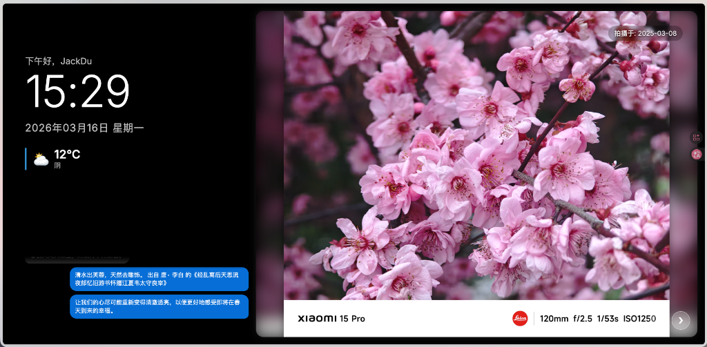

# Digital Photo Frame - 数字电子相框


一个开源的智能电子相框系统，支持照片幻灯片展示、留言板、智能推荐等功能。适合家庭使用，可将旧平板或电视改造成智能相框。




---

## ✨ 功能特性

### 🖼️ 照片展示

- **智能推荐算法 V2.0**: 95% 标签 + 季节加权推荐，5% 老照片"深海打捞"
- **多格式支持**: JPG, PNG, WebP, HEIC (iOS)
- **自动压缩**: 上传时智能压缩至指定大小，4K 分辨率上限
- **EXIF 保留**: 自动提取拍摄日期，保留照片元数据

### 💬 互动功能

- **留言板**: 家庭成员可留言互动
- **个性化问候**: 根据登录用户显示称呼
- **宝宝年龄**: 可选显示宝宝年龄（拍照时）

### 🌤️ 实用信息

- **天气显示**: 实时显示当地天气（Open-Meteo API）
- **时钟日历**: 显示时间、日期
- **多用户支持**: 支持多账户登录管理

### 📱 客户端

- **响应式设计**: 适配各种屏幕尺寸
- **Android TV 支持**: 遥控器方向键切换照片
- **全屏展示**: 支持沉浸式全屏模式

---

## 🚀 快速开始

### 方式一：Docker 部署（推荐）

1. 克隆项目：

```bash
git clone https://github.com/YOUR_USERNAME/digital-photo-frame.git
cd digital-photo-frame
```

2. 配置环境变量：

```bash
cp .env.example .env
# 编辑 .env 文件，修改配置
```

3. 启动容器：

```bash
docker-compose up -d
```

4. 访问应用：

打开浏览器访问 `http://localhost:5000`

默认管理员账户：`admin / password`（请在 .env 中修改）

### 方式二：本地运行

1. 安装依赖：

```bash
pip install -r requirements.txt
```

2. 运行应用：

```bash
python app.py
```

3. 访问 `http://localhost:5000`

### 方式三：云平台一键部署

#### Railway

&nbsp;


#### Render

&nbsp;


---

## ⚙️ 配置说明

复制 `.env.example` 为 `.env` 并修改配置：

```bash
# ====================
# 基础配置
# ====================
FLASK_DEBUG=false
SECRET_KEY=your-secret-key-change-me

# ====================
# 用户认证
# ====================
ADMIN_USERS=admin:your-password

# ====================
# 宝宝/家庭配置（可选）
# ====================
BABY_NAME=宝宝名字        # 界面显示的宝宝称呼
BABY_BIRTHDAY=2025-01-01  # 宝宝生日，用于计算年龄

# ====================
# 天气配置
# ====================
WEATHER_LAT=31.3041    # 纬度
WEATHER_LON=120.5954   # 经度
WEATHER_ENABLED=true   # 是否启用天气

# ====================
# 照片推荐算法配置
# ====================
TAG_WEIGHTS=宝宝：1.8，露营：1.5，旅行：1.3
SLIDE_DURATION_SECONDS=300  # 每张展示时长（秒）
```

完整配置项请参考 [配置文档](docs/configuration.md)

---

## 📁 项目结构

```
digital-photo-frame/
├── app.py                    # Flask 主应用
├── config.py                 # 配置管理模块
├── requirements.txt          # Python 依赖
├── Dockerfile                # Docker 镜像构建
├── docker-compose.yml        # Docker Compose 配置
├── .env.example              # 环境变量模板
├── templates/
│   ├── index.html           # 主页面（相框展示）
│   ├── admin.html           # 后台管理
│   └── login.html           # 登录页面
├── static/
│   ├── script.js            # 前端 JavaScript
│   ├── style.css            # 样式表
│   └── photos/              # 照片存储目录
├── data/                    # 数据持久化目录（Docker）
└── docs/                    # 文档目录
    ├── README.md            # 本文档
    ├── deployment.md        # 部署指南
    └── configuration.md     # 配置说明
```

---

## 🎯 核心功能详解

### 智能推荐算法 V2.0

#### 常规模式（95% 概率）

```
最终权重 = 标签权重（静态）× 季节权重（动态）

季节权重：
- 当月照片：1.8
- 相邻月份：1.4
- 其他月份：0.85
- 无日期照片：0.5
```

#### 深海打捞模式（5% 概率）

- 筛选条件：拍摄日期 > 2 年（可配置）
- 排序策略：展示次数少优先 + 随机
- 视觉效果：复古滤镜 + "记忆偶然被打捞"提示

### 图片处理流程

1. **上传**: 支持拖拽上传，最大 200MB（可配置）
2. **压缩**: 智能压缩至 3MB 内（可配置），保留 EXIF
3. **元数据**: 自动提取拍摄日期，支持手动编辑
4. **存储**: 本地存储，SQLite 索引

---

## 🔧 常见问题

### Q: 如何修改天气显示的地理位置？

A: 在 `.env` 中修改 `WEATHER_LAT` 和 `WEATHER_LON` 为你所在位置的经纬度。

### Q: 如何禁用宝宝年龄显示？

A: 在 `.env` 中留空 `BABY_NAME` 和 `BABY_BIRTHDAY` 即可。

### Q: 如何调整照片展示时长？

A: 修改 `SLIDE_DURATION_SECONDS` 配置项（单位：秒）。

### Q: 照片存储在哪个目录？

A: Docker 部署时为 `./data/photos`，本地运行为 `./static/photos`。

### Q: 如何备份数据？

A: 备份以下文件：

- `photos.db` - 数据库
- `photo_metadata.json` - 照片元数据
- `messages.json` - 留言数据
- `static/photos/` - 照片文件

---

## 🛠️ 开发指南

### 本地开发环境

```bash
# 安装依赖
pip install -r requirements.txt

# 开发模式运行
export FLASK_DEBUG=true
python app.py

# 运行测试
pytest
```

### 代码格式化

```bash
# 安装开发依赖
pip install black ruff

# 格式化代码
black .
ruff check .
```

---

## 📝 更新日志

详见 [CHANGELOG.md](CHANGELOG.md)

### v2.0.0 (2026-03)

- ✨ 新增：配置模块化，所有硬编码转为环境变量
- ✨ 新增：Docker 一键部署支持
- ✨ 新增：天气 API 后端代理
- 🐛 修复：深海打捞算法参数可配置
- 🐛 修复：宝宝信息前端可配置

### v1.6.0 (2026-02)

- ✨ 新增：宝宝年龄显示
- ✨ 新增：深海打捞彩蛋功能

---

## 🤝 贡献指南

欢迎提交 Issue 和 Pull Request！

1. Fork 本仓库
2. 创建特性分支 (`git checkout -b feature/AmazingFeature`)
3. 提交更改 (`git commit -m 'Add some AmazingFeature'`)
4. 推送到分支 (`git push origin feature/AmazingFeature`)
5. 开启 Pull Request

详见 [贡献指南](docs/CONTRIBUTING.md)

---

## 📄 许可证

本项目采用 MIT 许可证 - 详见 [LICENSE](LICENSE) 文件

---

## 🙏 致谢

- [Flask](https://flask.palletsprojects.com/) - Web 框架
- [Pillow](https://pillow.readthedocs.io/) - 图片处理
- [Open-Meteo](https://open-meteo.com/) - 天气 API
- [pillow-heif](https://github.com/bigcat88/pillow-heif) - HEIC 支持

---

## 📧 联系方式

- 作者：[jackdu](https://github.com/jackdu2333)
- 项目地址：[GitHub Repository](https://github.com/jackdu2333/Electronic-Photo-Album-)

---

**Enjoy your memories! 📸**