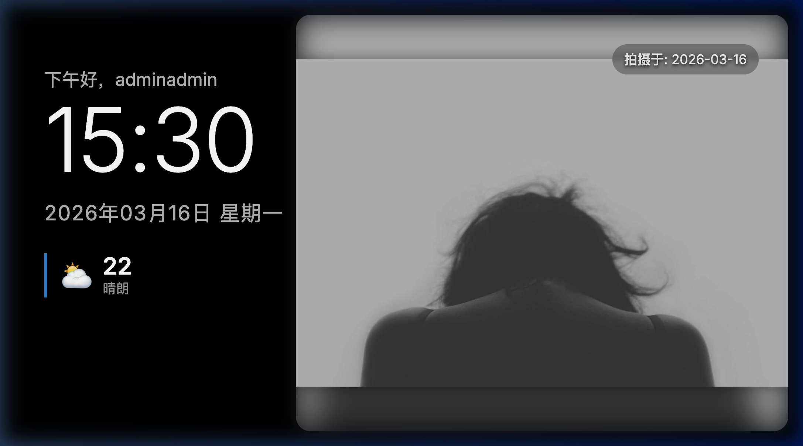
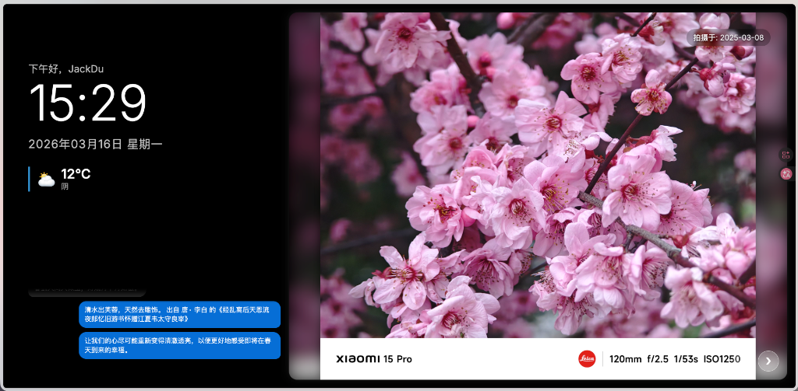

# Digital Photo Frame - 数字电子相框


一个开源的智能电子相框系统，支持照片幻灯片展示、留言板、智能推荐、多主题切换等功能。适合家庭使用，可将旧平板、电视或显示器改造成智能相框。

> **最新版本**: v3.0.1 (2026-06-13) — Memory Curator 推荐引擎 + 本地桌面客户端




---

## ✨ 功能特性

### 🖼️ 照片展示

- **智能推荐算法 V3.0**: Memory Curator 多频道策展引擎（今日回忆 / 好久不见 / 小故事 / 高光时刻 / 随缘漫游），播放冷却池避免重复，可解释推荐理由
- **多格式支持**: JPG, PNG, WebP, HEIC (iOS)
- **自动压缩**: 上传时智能压缩至指定大小，4K 分辨率上限
- **EXIF 保留**: 自动提取拍摄日期，保留照片元数据

### 🎨 多主题 UI

- **三套主题可选**: 经典分栏 / 沉浸全屏 / 画廊展签
- **环境色自适应**: 从照片提取主色调，动态应用到 UI 面板
- **隐藏式切换器**: 左上角唤出，选择保存至 localStorage
- **移动端适配**: 横屏/竖屏独立优化规则

### 💬 互动功能

- **留言板**: 家庭成员可留言互动，智能滚动定位
- **个性化问候**: 根据登录用户显示称呼
- **宝宝年龄**: 可选显示宝宝年龄（拍照时）

### 🌤️ 实用信息

- **天气显示**: 实时显示当地天气（Open-Meteo API，SSL 验证修复）
- **时钟日历**: 显示时间、日期
- **多用户支持**: 支持多账户登录管理，密码哈希加密

### 📱 客户端

- **桌面客户端 (Electron)**: macOS / Windows 原生应用，内嵌 Flask 后端，支持本地文件夹直接读取
- **响应式设计**: 适配各种屏幕尺寸（桌面/手机/平板）
- **Android TV 支持**: 遥控器方向键切换照片
- **全屏展示**: 支持沉浸式全屏模式
- **低亮度优化**: 提高暗部对比度，强化文字可读性

---

## 🚀 快速开始

### 方式一：Docker 部署（推荐）

1. 克隆项目：

```bash
git clone https://github.com/jackdu2333/Electronic-Photo-Album-OpenSource-.git
cd Electronic-Photo-Album-OpenSource-
```

2. 配置环境变量：

```bash
cp .env.example .env
# 编辑 .env 文件，修改配置
```

3. 启动容器：

```bash
docker-compose up -d
```

4. 访问应用：

打开浏览器访问 `http://localhost:5000`

首次运行前必须在 `.env` 中设置 `ADMIN_USERS`，例如：

```text
ADMIN_USERS=admin:ChangeMe123!
```

生产环境请改为自己的强密码。

### 方式二：本地运行

1. 安装依赖：

```bash
pip install -r requirements.txt
```

2. 运行应用：

```bash
python app.py
```

3. 访问 `http://localhost:5000`

### 方式三：云平台一键部署

#### Railway

&nbsp;


#### Render

&nbsp;


### 方式四：桌面客户端（macOS / Windows）

1. 克隆项目并安装前端依赖：

```bash
cd desktop
npm install
```

2. 打包应用：

```bash
# macOS
npm run build

# Windows
npm run build:win
```

3. 首次启动会自动创建 Python 环境并安装后端依赖，无需手动配置。

---

## ⚙️ 配置说明

复制 `.env.example` 为 `.env` 并修改配置：

```bash
# ====================
# 基础配置
# ====================
FLASK_DEBUG=false
SECRET_KEY=your-secret-key-change-me

# ====================
# 用户认证
# ====================
ADMIN_USERS=admin:your-password

# ====================
# 宝宝/家庭配置（可选）
# ====================
BABY_NAME=宝宝名字        # 界面显示的宝宝称呼
BABY_BIRTHDAY=2025-01-01  # 宝宝生日，用于计算年龄

# ====================
# 天气配置
# ====================
WEATHER_LAT=31.3041    # 纬度
WEATHER_LON=120.5954   # 经度
WEATHER_ENABLED=true   # 是否启用天气

# ====================
# 照片推荐算法配置
# ====================
TAG_WEIGHTS=宝宝：1.8，露营：1.5，旅行：1.3
SLIDE_DURATION_SECONDS=300  # 每张展示时长（秒）
```

完整配置项请参考 [配置文档](docs/configuration.md)

---

## 📁 项目结构

```
digital-photo-frame/
├── app.py                    # Flask 主应用
├── config.py                 # 配置管理模块
├── auth.py                   # 认证与 Session 管理
├── requirements.txt          # Python 依赖
├── Dockerfile                # Docker 镜像构建
├── docker-compose.yml        # Docker Compose 配置
├── .env.example              # 环境变量模板
├── desktop/                  # Electron 桌面客户端
│   ├── main.js               # 主进程（Flask 服务管理 + IPC）
│   ├── preload.js             # 预加载脚本
│   ├── renderer/              # 渲染进程页面
│   └── package.json           # Electron 构建配置
├── routes/                   # API 路由模块
│   ├── api.py                # 核心 API（天气、照片、状态）
│   ├── health.py             # 健康检查接口
│   ├── messages.py           # 留言板 API
│   ├── photos_v3.py          # v3 照片源 API（CRUD + 图片读取）
│   ├── recommendation.py     # 推荐算法路由
│   └── upload.py             # 上传 API
├── services/                 # 业务逻辑层
│   ├── database.py           # 数据库服务（含播放历史）
│   ├── image.py              # 图片处理服务
│   ├── metadata.py           # 元数据服务
│   ├── photo_index.py        # 照片索引服务（兼容层）
│   ├── photo_service.py      # v3 统一照片服务
│   ├── photo_source.py       # 照片源抽象层（桌面/上传/iOS）
│   └── recommendation.py     # Memory Curator 推荐引擎
├── templates/
│   ├── index.html           # 主页面（相框展示，支持多主题）
│   ├── admin.html           # 后台管理
│   ├── login.html           # 登录页面
│   └── manage.html          # 管理页面
├── static/
│   ├── script.js            # 前端 JavaScript（环境色提取）
│   ├── style.css            # 样式表
│   └── photos/              # 照片存储目录
├── data/                    # 数据持久化目录（Docker）
└── docs/                    # 文档目录
```

---

## 🎯 核心功能详解

### 智能推荐算法 V3.0 — Memory Curator

多频道策展引擎，让相册像"懂回忆的人"：

```
频道配比（默认）：
  今日回忆 20%  — 往年今天、同月季节照片加权
  好久不见 20%  — 低 view_count 老照片优先
  小故事   20%  — 延续上一张的标签/月份故事（2-4 张一组）
  高光时刻 25%  — 高权重标签照片优先
  随缘漫游 15%  — 随机 + 低曝光补偿
```

核心机制：
- **播放冷却池**：最近 30 张不重复推荐
- **缺失过滤**：`missing=true` 的照片自动排除
- **可解释推荐**：每次返回 `recommend_channel` + `recommend_reason`
- **播放历史**：`photo_play_history` 表记录频道、理由、时间
- **向后兼容**：旧数据自动迁移 v3 字段，前端无感切换

### 环境色自适应主题

从当前照片提取主色调，动态应用到 UI 面板：

```javascript
// 提取逻辑
1. 采样照片 40x40 像素区域
2. 计算平均色、最亮色、最暗色
3. 混合预设配色生成主题变量
4. 应用到 CSS 自定义属性
```

**支持主题**：
- `style-2`: 沉浸全屏相框风（默认）
- `style-4`: Floating Glass 浮空玻璃卡片
- `style-6`: Poster 海报风格

### 图片处理流程

1. **上传**: 支持拖拽上传，最大 200MB（可配置）
2. **压缩**: 智能压缩至 3MB 内（可配置），保留 EXIF
3. **元数据**: 自动提取拍摄日期，支持手动编辑
4. **存储**: 本地存储，SQLite 索引

---

## 🔧 常见问题

### Q: 如何修改天气显示的地理位置？

A: 在 `.env` 中修改 `WEATHER_LAT` 和 `WEATHER_LON` 为你所在位置的经纬度。

### Q: 如何禁用宝宝年龄显示？

A: 在 `.env` 中留空 `BABY_NAME` 和 `BABY_BIRTHDAY` 即可。

### Q: 如何调整照片展示时长？

A: 修改 `SLIDE_DURATION_SECONDS` 配置项（单位：秒）。

### Q: 照片存储在哪个目录？

A: Docker 部署时为 `./data/photos`，本地运行为 `./static/photos`。

### Q: 如何备份数据？

A: 备份以下文件：

- `photos.db` - 数据库
- `photo_metadata.json` - 照片元数据
- `messages.json` - 留言数据
- `static/photos/` - 照片文件

---

## 🛠️ 开发指南

### 本地开发环境

```bash
# 安装依赖
pip install -r requirements.txt
pip install -r requirements-dev.txt

# 开发模式运行
export FLASK_DEBUG=true
python app.py

# 运行测试（95 tests）
pytest -v
```

### 代码格式化

```bash
# 格式化代码
black .
ruff check .
```

---

## 📝 更新日志

详见 [CHANGELOG.md](CHANGELOG.md)

### v3.0.1 (2026-06-13)

**验收评审修复**：
- 🐛 修复：推荐频道降级到随机漫游时 `recommend_channel` 未同步更新为 `random`
- 🐛 修复：`desktop/package.json` 依赖版本与 `package-lock.json` 不一致（对齐 electron ^42.4.0, electron-builder ^26.15.2）
- 🐛 修复：Windows 下 venv Python 路径硬编码 `bin/python`（新增 `getVenvPython()` 跨平台 helper）
- ♻️ 重构：`findPython()` 项目 venv 检测统一使用 `getVenvPython()`
- 📦 补充：`.gitignore` 新增 `output/` 规则

### v3.0.0 (2026-06-12)

**Memory Curator 推荐引擎**：
- ✨ 新增：v3.0 多频道推荐（今日回忆 / 好久不见 / 小故事 / 高光时刻 / 随缘漫游）
- ✨ 新增：播放冷却池，最近 30 张不重复
- ✨ 新增：`recommend_channel` + `recommend_reason` 可解释推荐
- ✨ 新增：`photo_play_history` 播放历史表
- ✨ 新增：低曝光补偿、故事连续性、往年今天加权
- ✨ 优化：`view_count` 按 photo id 自增（兼容旧 url 模式）

**本地桌面客户端 (Electron)**：
- ✨ 新增：macOS / Windows 原生桌面应用
- ✨ 新增：内嵌 Flask 后端，首次启动自动创建 Python venv
- ✨ 新增：本地文件夹直接读取（无需上传到服务器）
- ✨ 新增：v3 照片源抽象层（DesktopFolder / ImportedCopy）
- ✨ 新增：温馨相框风格 app 图标

**v3 照片模型**：
- ✨ 新增：`id`、`display_url`、`source_type`、`missing` 等 v3 字段
- ✨ 新增：`PhotoService` 统一照片服务（替代旧 `PhotoIndexService`）
- ✨ 新增：`/api/photos/<id>/image` 图片读取路由
- ✨ 新增：旧数据自动迁移（`migrate_v3_records`）
- 🐛 修复：云端部署完全向后兼容，零配置升级

### v2.0.3 (2026-03-31)

**Android TV / 安卓端**：
- ✨ 优化：移除原生层常驻“更换地址”按钮，避免与网页展示层入口重叠
- ✨ 优化：服务器地址修改入口并入网页设置菜单与独立主题样式菜单
- 🐛 修复：首页竖屏设置图标与样式切换入口重叠的问题

### v2.0.2 (2026-03-31)

**登录与会话体验**：
- ✨ 新增：登录页支持“保持登录 30 天”
- ✨ 新增：首页、独立主题页、管理后台统一补齐退出登录入口
- ✨ 优化：登录页切回标准表单提交流程，更利于浏览器/系统密码管理器接管账号密码保存

**Android TV / 安卓端**：
- ✨ 新增：首次启动输入服务器地址，地址仅保存在设备本地
- ✨ 新增：已连接后可随时修改服务器地址，遥控器支持菜单键重新配置
- 🐛 修复：安卓端不再写死服务器地址与 `admin/password`

**主题与展示细节**：
- 🐛 修复：日式禅意主题右侧题签压缩每日一句、重复展示日期的问题
- 🐛 修复：日式禅意主题左下角“记忆”印章在平板上显示不全的问题

### v2.0.1 (2026-03-23)

**展示与样式中心**：
- ✨ 新增：7-16 独立主题整合进统一样式菜单
- ✨ 新增：样式菜单自动隐藏、分组展示、连续排序
- ✨ 新增：瀑布流 / 全景卷轴 / 拍立得墙 / 艺术画廊四套策展样式
- ✨ 新增：大屏端多分辨率适配与长时播放场景优化

**照片元数据与便签**：
- ✨ 新增：`note_title` / `note_body` 元数据读写
- ✨ 新增：style15 拍立得墙便签编辑、自动保存与手动保存
- ✨ 新增：style16 艺术画廊直接读取便签标题与正文
- ✨ 新增：每日一言接口与样式内文案展示

**体验优化**：
- 🐛 修复：部分样式缺失拍摄时间与“记忆打捞”提示
- 🐛 修复：多图样式一次性加载全部照片导致的大相册卡顿
- 🐛 修复：style15 编辑弹窗保存区偶发不显示、CSRF 缺失、图片预览空白
- 🐛 修复：style16 信息区标签重复显示
 

### v2.0.0 (2026-03-20)

**UI/UX 升级**：
- ✨ 新增：三套主题 UI（经典分栏 / 沉浸全屏/画廊展签）
- ✨ 新增：环境色自适应主题（从照片提取主色调）
- ✨ 新增：隐藏式样式切换器（左上角唤出）
- ✨ 新增：登录页重设计（产品感入口页面）
- ✨ 新增：移动端横屏/竖屏适配优化
- 🐛 修复：留言区滚动定位逻辑（只在底部时自动吸附）
- 🐛 修复：样式二横图被信息区遮挡问题
- 🐛 修复：低亮度场景下文字可读性

**核心功能增强**：
- ✨ 新增：智能推荐算法 V2.0（季节加权 + 深海打捞）
- ✨ 新增：宝宝年龄计算显示
- ✨ 新增：照片预加载机制
- ✨ 新增：强制展示模式（10 分钟优先展示）

**架构与稳定性**：
- ✨ 新增：配置模块化，所有硬编码转为环境变量
- ✨ 新增：Docker 一键部署支持
- ✨ 新增：天气 API SSL 验证修复
- ✨ 新增：SQLite busy timeout 可配置
- 🐛 修复：深海打捞算法参数可配置
- 🐛 修复：宝宝信息前端可配置
- 🐛 修复：静态资源认证拦截问题

**认证与安全**：
- ✨ 新增：密码 PBKDF2-SHA256 哈希加密
- ✨ 新增：登录失败锁定（5 次失败锁定 5 分钟）
- ✨ 新增：Session 24 小时自动过期
- ✨ 新增：密码强度验证

### v1.6.0 (2026-02)

- ✨ 新增：宝宝年龄显示
- ✨ 新增：深海打捞彩蛋功能

---

## 🤝 贡献指南

欢迎提交 Issue 和 Pull Request！

1. Fork 本仓库
2. 创建特性分支 (`git checkout -b feature/AmazingFeature`)
3. 提交更改 (`git commit -m 'Add some AmazingFeature'`)
4. 推送到分支 (`git push origin feature/AmazingFeature`)
5. 开启 Pull Request

详见 [贡献指南](docs/CONTRIBUTING.md)

---

## 📄 许可证

本项目采用 MIT 许可证 - 详见 [LICENSE](LICENSE) 文件

---

## 🙏 致谢

- [Flask](https://flask.palletsprojects.com/) - Web 框架
- [Pillow](https://pillow.readthedocs.io/) - 图片处理
- [Open-Meteo](https://open-meteo.com/) - 天气 API
- [pillow-heif](https://github.com/bigcat88/pillow-heif) - HEIC 支持
- [Inter Font](https://rsms.me/inter/) - 字体

---

## 📧 联系方式

- 作者：[jackdu](https://github.com/jackdu2333)
- 项目地址：[GitHub Repository](https://github.com/jackdu2333/Electronic-Photo-Album-OpenSource-)

---

**Enjoy your memories! 📸**
